# API_ToDO

Documentation link :https://paper-father-7d5.notion.site/To-Do-API-91026a7e662a4ec79d92fcab92600a3a


##Run using 
## create new database 
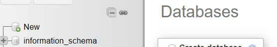
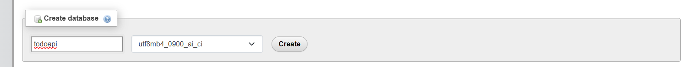


## import database 
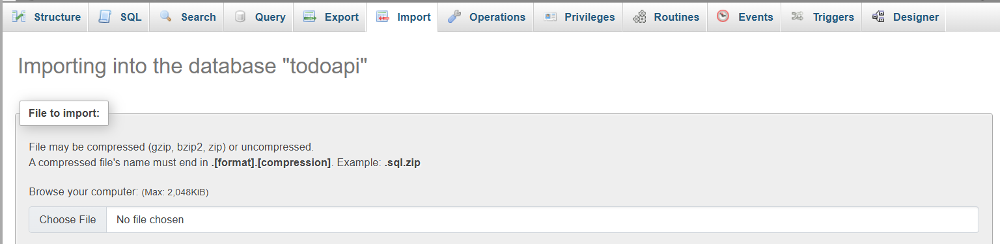
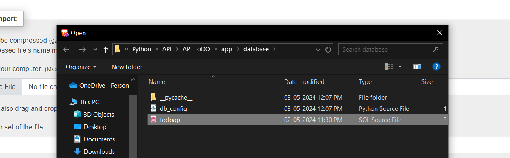


Make sure your docker engine is turned on
run ```docker-compose up --build```
open terminal run ```docker contanier ls```
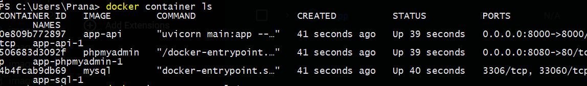

run ```docker inspect <sql_image_name>```

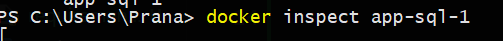

copy IP address 

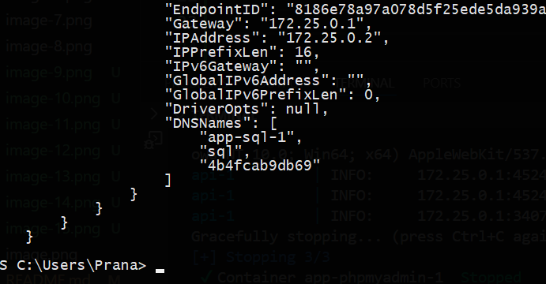

got to app/database/db_config
replace host with current IP

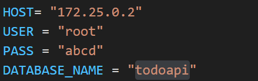

You are good to go 

## Bearer token
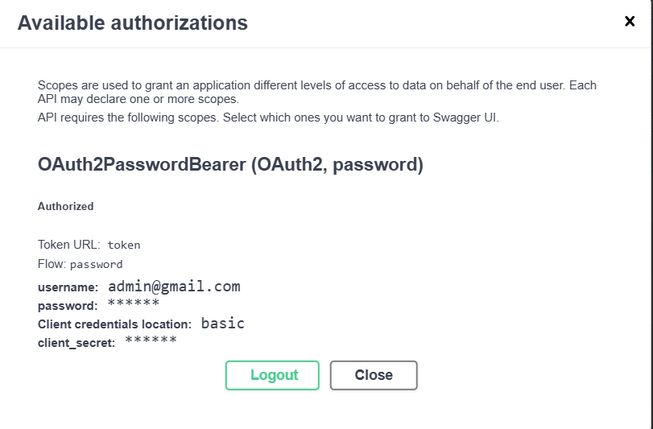

## /signup
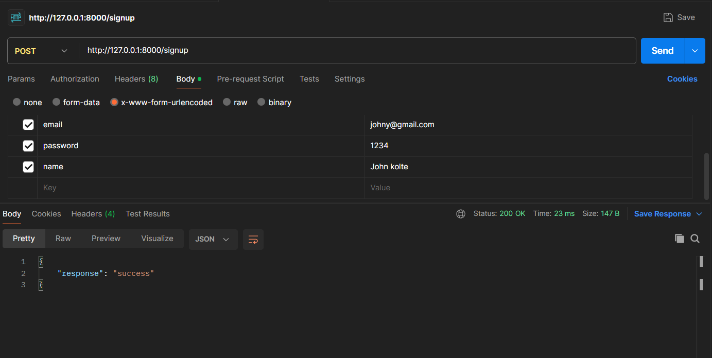

## UID/{email}
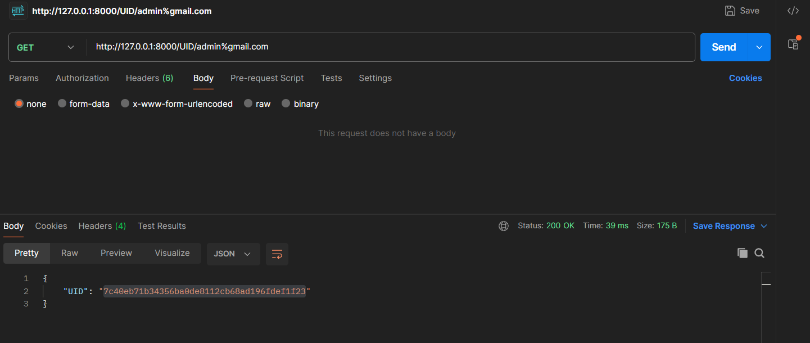

## task/create/
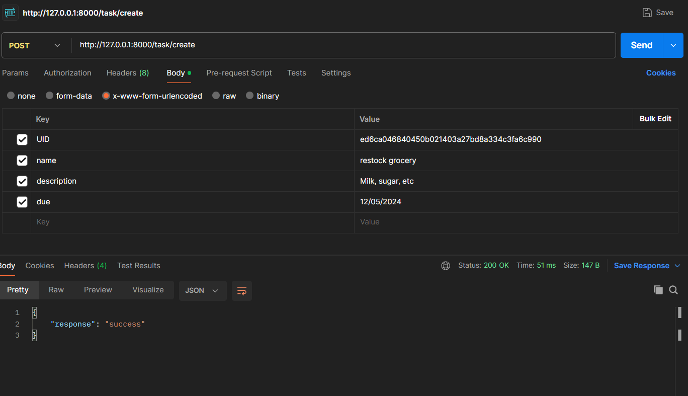


## task/all/{UID}
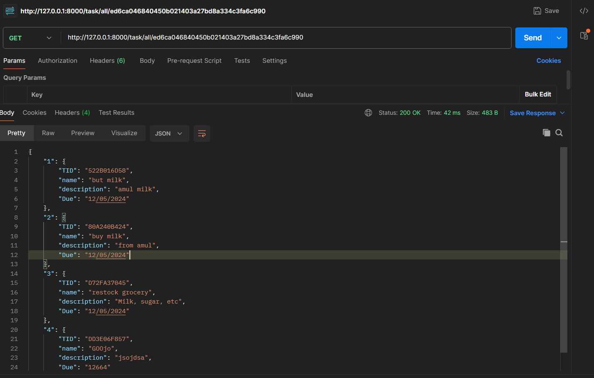

## task/delete/{TID}


## task/update/
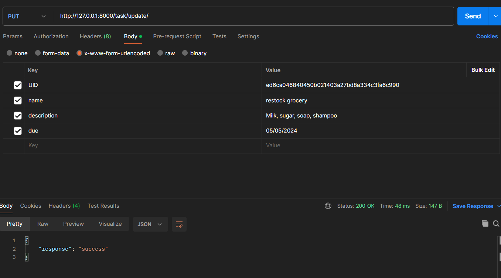


## database snapshots
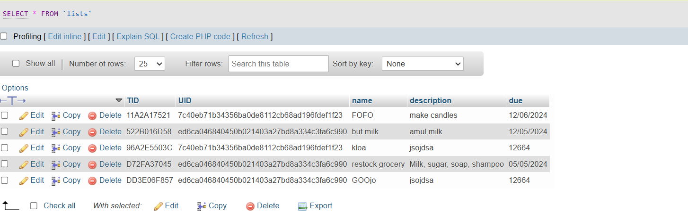
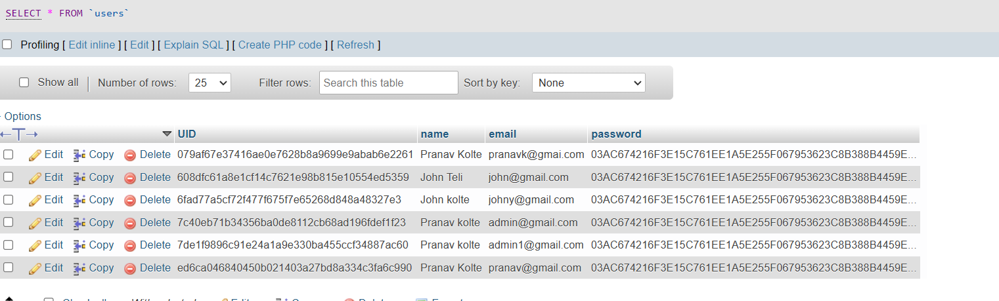
